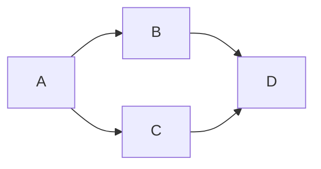

# 存放场地预约的代码
## 核心部分就是获取真正的预约请求和其中data参数的部分了！找不到的就疯狂找，有规律的就利用规律。
- 目前获取到了各个部分的请求有效载荷的原始形式，以键值对的方式呈现出来   
- 请求方法一直都是post 类型是xml 和 json（查询一下json是什么） ------->待办
- 

```mermaid
	graph LR;
	A-->B;
	A-->C;
	B-->D;
	C-->D;
```
	

